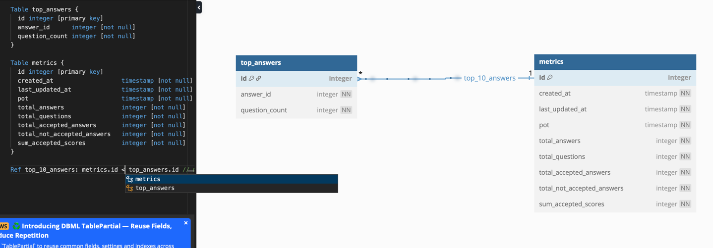

# StackExchange-Statistics-Service
a Python-based REST API service that retrieves data from the StackExchange API, calculates specific statistics, and reports the results.

### Project Goals
 - Provide a REST API endpoint to retrieve StackOverflow answer data within a specified date/time range.
 - Calculate and return specific statistics based on the retrieved data.

 #### Functional Requirements 
 1. Expose a REST API endpoint at:
GET http://localhost:5000/api/v1/stackstats?since=<datetime>&until=<datetime>
 2. Accept two datetime parameters (since and until) in the format:
YYYY-MM-DD HH:MM:SS
 3. Retrieve StackOverflow answers within the specified date/time range using the StackExchange API (1st call).
 4. Retrieve comments associated with these answers (2nd call).
 5. Calculate the following:
    * Total number of **accepted** answers.
    * Average score of the **accepted** answers.
    * Average answer count per question.
    * Comment count for each of the top 10 answers with the highest scores.
 6. Cache the results for faster repeated retrievals.
 7. Statistical measures will be rounded to three decimals. 
 
  #### Non-Functional Requirements 
  1. Python version: >=3.6

### Key Components

#### Structure
```aiignore
src/
├── app/
        run.py                   # Flask app
│   ├── components/
│   │   ├── stackexchange.py     # StackExchange API integration
        ├── rate_limits.py       # Comply with tha rate limitations of the Stackexchange API
        ├── statistics.py        # Statistics calculations
notebooks/
│   ├── stackexchange_notebook.ipynb # demo - tests
├── .gitignore
├── requirements.txt            # Python dependencies
└── README.md                   # Project documentation
```

#### Stackexchange API Client
- **`src/app/components/stackexchange.py`**: Contains the `StackExchangeClient` class for interacting with the StackExchange API. It supports fetching answers and comments with pagination and batching.
- **`notebooks/stackexchange_notebook.ipynb`**: A Jupyter Notebook demonstrating the usage of the `StackExchangeClient` and testing its functionality.
- **`TODO:`**: Add routines to validate API responses. 

#### Statistics Calculation
- **`src/app/components/statistics.py`**: Contains the `StatisticsCalculator` class for calculating statistics based on the retrieved StackOverflow data. It includes methods for calculating accepted answers, average scores, and comment counts for top answers.
- **`StatisticsCalculator.compute() method:`** Takes a list of answer ids and returns a dictionary with the calculated statistics.

#### Flask app
- **`src/app/run.py`**: Contains a simple endpoint for getting the response from the calculations.

#### Caching (Resources: [Supercharge Your Flask App with Flask-Caching: A Comprehensive Guide (Part 1)](https://medium.com/@jessicaovabor/supercharge-your-flask-app-with-flask-caching-a-comprehensive-guide-part-1-754d13570449))

**`Description:`**
```aiignore
We first need to understand how volatile each metric is—how quickly and often it changes.

Total number of answers:
This value is generally stable within a given time range, unless a user deletes an answer. Such deletions are rare, but possible.
Accepted status:
The accepted status of an answer can change at any time, since the question author can mark a different answer as accepted later.
Score:
The score of an answer is also volatile, as it can increase or decrease at any time due to upvotes or downvotes.
Average number of answers per question:
This metric is relatively stable, but not completely non-volatile. If an answer is deleted from any question within the time range, the average will change. So, while it’s less volatile than the other metrics, it’s not entirely static.
Comments:
Comments are mostly volatile, since users can add or remove comments on answers at any time.

A simple caching layer is added to the Flask app with a default timeout (ttl) of 1800 seconds.

In production, this simple caching can be replaced by a redis server 
```

```aiignore
We can also add some data persistance in the form of a database:
```


```tsql
CREATE TABLE "metrics" (
  "id" integer PRIMARY KEY,
  "created_at" timestamp NOT NULL,
  "last_updated_at" timestamp NOT NULL,
  "pot" timestamp NOT NULL,
  "total_answers" integer NOT NULL,
  "total_questions" integer NOT NULL,
  "total_accepted_answers" integer NOT NULL,
  "total_not_accepted_answers" integer NOT NULL,
  "sum_accepted_scores" integer NOT NULL
);

CREATE TABLE "top_answers" (
  "id" integer PRIMARY KEY,
  "answer_id" integer NOT NULL,
  "question_count" integer NOT NULL
);
```